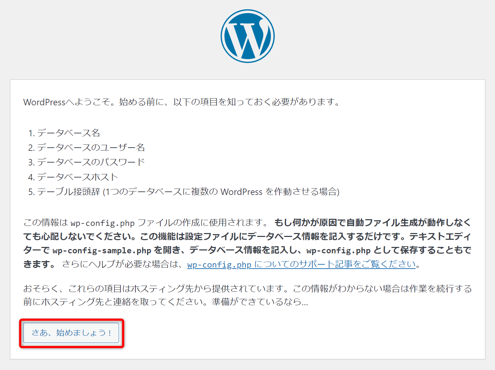
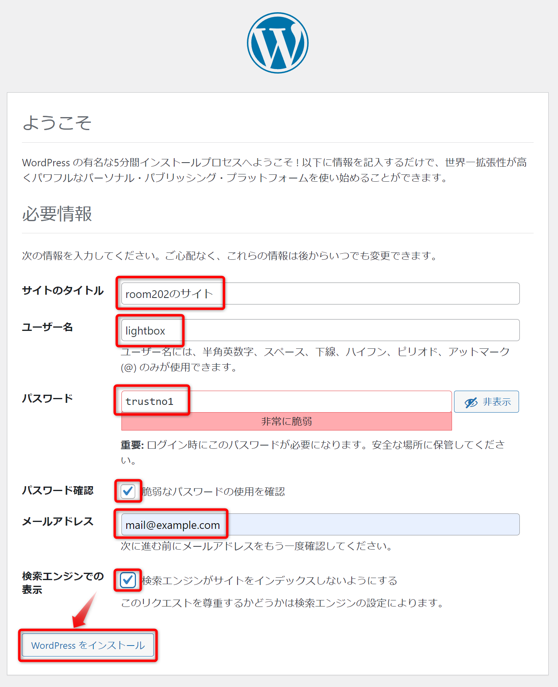

# CentOS Stream 9 での LAMP環境構築

## 前提条件

[VirtualBox に CentOS Stream 9をインストールする](https://github.com/room202/vbox-centos9)

## 一般ユーザーからrootユーザーに切り替え

```bash
su -
```

**実行結果**

```bash
パスワード:
```

**説明**

パスワードの入力を求められるので、rootユーザーのパスワードを入力してください。  
※入力できていないように見えますが、入力できています。

## ファイアウォールの無効化

### 状態を確認

```bash
systemctl status firewalld
```

**実行結果**

```bash
● firewalld.service - firewalld - dynamic firewall daemon
     Loaded: loaded (/usr/lib/systemd/system/firewalld.service; enabled; preset: enabled)
     Active: active (running) since Mon 2024-04-22 20:03:13 JST; 28min ago
```

**説明**

Active: active (running) と表示されていたら起動中です。

### ファイアウォールを止める

```bash
systemctl stop firewalld
```

### 状態を再確認

```bash
systemctl status firewalld
```

**実行結果**

```bash
○ firewalld.service - firewalld - dynamic firewall daemon
     Loaded: loaded (/usr/lib/systemd/system/firewalld.service; enabled; preset: enabled)
     Active: inactive (dead) since Mon 2024-04-22 20:33:09 JST; 24s ago
```

**説明**

Active: inactive (dead) と表示されていたら止まっています。

### 自動起動設定を確認

```bash
systemctl is-enabled firewalld
```

**実行結果**

```bash
enabled
```

**説明**

enabled と表示されていたら、次回起動時に自動起動します。  
この設定を無効化します。

### 自動起動設定を無効化

```bash
systemctl disable firewalld
```

**実行結果**

```bash
Removed "/etc/systemd/system/multi-user.target.wants/firewalld.service".
Removed "/etc/systemd/system/dbus-org.fedoraproject.FirewallD1.service".
```

### 自動起動設定を再確認

```bash
systemctl is-enabled firewalld
```

**実行結果**

```bash
disabled
```

**説明**

disabled と表示されていたら、自動起動設定を無効化できています。

## SELinuxの無効化

### 設定の確認

```bash
getenforce
```

**実行結果**

```bash
Enforcing
```

**説明**

Enforcing と表示されていたら、SELinuxが有効です。  
この設定を無効化します。

### 無効化の設定

```bash
vim /etc/selinux/config
```

下記の通り設定を変更してください。

```
SELINUX=enforcing
↓
SELINUX=disabled
```

```:/etc/selinux/config
...省略...

#
# To revert back to SELinux enabled:
#
#    grubby --update-kernel ALL --remove-args selinux
#
SELINUX=disabled  ←ココを「enforcing」→「disabled」に変更
# SELINUXTYPE= can take one of these three values:
#     targeted - Targeted processes are protected,
#     minimum - Modification of targeted policy. Only selected processes are protected.
#     mls - Multi Level Security protection.
SELINUXTYPE=targeted

...省略...
```

### 再起動

変更後、下記コマンドで再起動してください。  
※再起動後、一般ユーザーからrootユーザーに切り替えを忘れずに！！

```bash
shutdown -r now
```

再起動後、一般ユーザーからrootユーザーに切り替え

```bash
su -
```

### 無効化の確認

```bash
getenforce
```

**実行結果**

```bash
Disabled
```

**説明**

Disabled と表示されていたら、SELinuxを無効化できています。

## Apacheのインストール

### インストール

```bash
dnf install -y httpd
```

### 起動

```bash
systemctl start httpd
```

### 起動状態の確認

```bash
systemctl status httpd
```

**実行結果**

```bash
● httpd.service - The Apache HTTP Server
     Loaded: loaded (/usr/lib/systemd/system/httpd.service; disabled; preset: disabled)
     Active: active (running) since Tue 2024-04-23 09:18:33 JST; 6s ago
```

**説明**

Active: active (running) と表示されていたら起動中です。

### 自動起動設定を有効化

```bash
systemctl enable httpd
```

**実行結果**

```bash
Created symlink /etc/systemd/system/multi-user.target.wants/httpd.service → /usr/lib/systemd/system/httpd.service.
```

### 自動起動設定を確認

```bash
systemctl is-enabled httpd
```

**実行結果**

```bash
enabled
```

**説明**

enabled と表示されていたら、次回起動時に自動起動します。

### Apacheにアクセスする

http://localhost/

にブラウザでアクセスしてください。  
`HTTP SERVER TEST PAGE`が表示されたら成功です。


## PHPのインストール

### モジュールの確認

```bash
dnf module list php
```

**実行結果**

```bash
メタデータの期限切れの最終確認: 0:14:02 前の 2024年04月23日 09時17分12秒 に実施しました。
CentOS Stream 9 - AppStream
Name      Stream    Profiles                     Summary
php       8.1       common [d], devel, minimal   PHP scripting language
php       8.2 [e]   common [d], devel, minimal   PHP scripting language
```

今回はVersion`PHP 8.2`をインストールする

### モジュールの切り替え

```bash
dnf module enable php:8.2 -y
```

### PHP 8.2.xのインストール

```bash
dnf install -y php
```

### インストールの確認

```bash
php -v
```

**実行結果**

```bash
PHP 8.2.13 (cli) (built: Nov 21 2023 09:55:59) (NTS gcc x86_64)
Copyright (c) The PHP Group
Zend Engine v4.2.13, Copyright (c) Zend Technologies
    with Zend OPcache v8.2.13, Copyright (c), by Zend Technologies
```

**説明**

PHP 8.2.13 が今回インストールされたPHPのVersionです。

### Apache再起動

```bash
systemctl restart httpd
```

## MariaDBのインストール

### レポジトリファイルの作成

```bash
vim /etc/yum.repos.d/mariadb.repo
```

**説明**

新規作成で空のファイルが開かれます。
下記内容を貼り付けてください。

```:mariadb.repo
# MariaDB 10.11 CentOS repository list - created 2024-04-06 04:50 UTC
# https://mariadb.org/download/
[mariadb]
name = MariaDB
# rpm.mariadb.org is a dynamic mirror if your preferred mirror goes offline. See https://mariadb.org/mirrorbits/ for details.
# baseurl = https://rpm.mariadb.org/10.11/centos/$releasever/$basearch
baseurl = https://ftp.yz.yamagata-u.ac.jp/pub/dbms/mariadb/yum/10.11/centos/$releasever/$basearch
module_hotfixes = 1
# gpgkey = https://rpm.mariadb.org/RPM-GPG-KEY-MariaDB
gpgkey = https://ftp.yz.yamagata-u.ac.jp/pub/dbms/mariadb/yum/RPM-GPG-KEY-MariaDB
gpgcheck = 1
enable=1
```

### インストール

```bash
dnf install -y MariaDB-devel MariaDB-client MariaDB-server
```

### 起動

```bash
systemctl start mariadb
```

### 起動状態の確認

```bash
systemctl status mariadb
```

**実行結果**

```bash
● mariadb.service - MariaDB 10.11.7 database server
     Loaded: loaded (/usr/lib/systemd/system/mariadb.service; disabled; preset: disabled)
    Drop-In: /etc/systemd/system/mariadb.service.d
             mqmigrated-from-my.cnf-settings.conf
     Active: active (running) since Tue 2024-04-23 09:46:27 JST; 2s ago
```

**説明**

Active: active (running) と表示されていたら起動中です。

### 自動起動設定を有効化

```bash
systemctl enable mariadb
```

**実行結果**

```bash
Created symlink /etc/systemd/system/multi-user.target.wants/mariadb.service → /usr/lib/systemd/system/mariadb.service.
```

### 自動起動設定を確認

```bash
systemctl is-enabled mariadb
```

**実行結果**

```bash
enabled
```

**説明**

enabled と表示されていたら、次回起動時に自動起動します。

### 初期設定スクリプト実行

```bash
mariadb-secure-installation
```

質問形式でMariaDBの初期設定を行ってくれます。

- Enter current password for root (enter for none):  
  - MariaDBの現在のrootパスワードを入力してください。  
    - 初期はパスワード無し(none)なので、そのままEnter  

- Switch to unix_socket authentication [Y/n]  
  - unix_socket認証に切り替えます。
    - `Y`を入力してEnterキー

- Change the root password? [Y/n]
  - Rootのパスワードを変更しますか？
    - `Y`を入力してEnterキー
    - パスワードを入力してください。

- Remove anonymous users? [Y/n]
  - 匿名ユーザーを削除しますか？
    - `Y`を入力してEnterキー

- Disallow root login remotely? [Y/n]
  - リモートからのrootログインを無効にしますか？
    - `n`を入力してEnterキー

- Remove test database and access to it? [Y/n]
  - testデータベースとアクセス権限を削除しますか？
    - `n`を入力してEnterキー

- Reload privilege tables now? [Y/n]
  - 特権テーブルを今すぐ再読み込みしますか？
    - `Y`を入力してEnterキー

## MariaDBにユーザーの追加と特権の設定

### MariaDBにログイン

```bash
mysql -u root -p
```

**実行結果**

```bash
Enter password:
```

**説明**

MariaDBのrootユーザーのパスワードを入力してください。  
※CentOS9のrootユーザーのパスワードではありません。


### ユーザーの追加

```sql
CREATE USER 'lightbox'@'%' IDENTIFIED BY 'trustno1';
```

### 特権の設定と反映

```sql
GRANT ALL PRIVILEGES ON *.* TO 'lightbox'@'%' WITH GRANT OPTION;
FLUSH PRIVILEGES;
```

### MariaDBからログアウト

```sql
exit;
```

## phpMyAdminのインストール

### remiレポジトリの追加

```bash
dnf install -y https://rpms.remirepo.net/enterprise/remi-release-9.rpm
```

### インストール

```bash
dnf install -y --enablerepo=remi phpMyAdmin
```

### phpMyAdminを外部のPCからアクセスさせる設定

```bash
vim /etc/httpd/conf.d/phpMyAdmin.conf
```

下記の通り設定を変更してください。

```bash
Require local
↓
Require all granted
```

```bash:/etc/httpd/conf.d/phpMyAdmin.conf
# phpMyAdmin - Web based MySQL browser written in php
#
# Allows only localhost by default
#
# But allowing phpMyAdmin to anyone other than localhost should be considered
# dangerous unless properly secured by SSL

Alias /phpMyAdmin /usr/share/phpMyAdmin
Alias /phpmyadmin /usr/share/phpMyAdmin

<Directory /usr/share/phpMyAdmin/>
   AddDefaultCharset UTF-8

   Require all granted    ←ここ「local」→「all granted」に変更
</Directory>
```

### Apacheの再起動

```bash
systemctl restart httpd
```

### phpMyAdminにアクセスする
http://localhost/phpmyadmin

にブラウザでアクセスしてください。

ユーザー名とパスワードを入力してください。


phpMyAdminにログイン成功　　


## WordPressのインストール

### ダウンロード

```bash
cd /var/www/html
wget https://ja.wordpress.org/latest-ja.tar.gz
```

### 解凍

```bash
tar xvf latest-ja.tar.gz
```

### ディレクトリの所有者をapacheに変更

```bash
chown -R apache:apache .
```

### WordPress用のデータベースを作成

#### MariaDBにログイン

```bash
mysql -u root -p
```

#### WordPress用のデータベースを作成

```bash
create database wordpress default character set utf8;
```

#### WordPress用のユーザーを作成

```bash
GRANT ALL ON wordpress.* TO wordpress@localhost IDENTIFIED BY 'trustno1';
FLUSH PRIVILEGES;
quit
```

### WordPressの初期設定

http://localhost/wordpress

にブラウザでアクセスしてください。

「さあ、始めましょう！」をクリックしてください。


- データベース名 : wordpress
- ユーザー名 : wordpress
- パスワード : trustno1


`インストール実行`をクリック  


- サイトのタイトル : 好きなタイトル
- ユーザー名 : 好きなユーザー名
- パスワード : 好きなパスワード
- パスワード確認 : `□脆弱なパスワードの使用を確認`が出たらチェックを入れる
- メールアドレス : 自分のメールアドレス
- 検索エンジンでの表示 : `□検索エンジンがサイトをインデックスしないようにする`にチェック



`ログイン`をクリック  


先ほど設定したユーザー名とパスワードを入力して`ログイン`  


WordPressにログイン成功  

